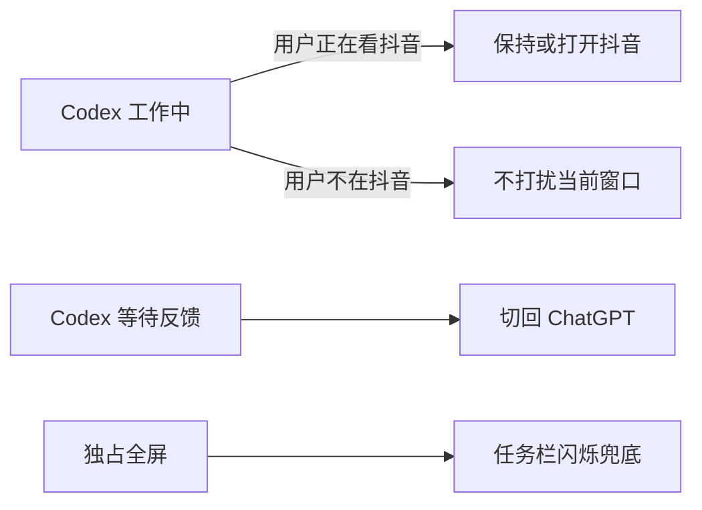

[English](README_EN.md)

# Codex 抖音助手（Windows 版）

一个 Windows 托盘工具：观察本地 Codex/ChatGPT 会话文件的状态，在恰当时机于抖音网页与 ChatGPT 窗口之间切换焦点。它只会在下述条件下改变焦点，不提供服务器或账户集成。

## 下载与 CI

从 [最新 Release](https://github.com/tobyberry666/codex-douyin-windows/releases/latest) 获取 `DouyinForCodex.exe`，并与 `run.bat` 放到同一文件夹。构建与自检由 [GitHub Actions CI](.github/workflows/ci.yml) 在 Windows 上验证。

## 30 秒启动

1. 下载最新 Release 中的 `DouyinForCodex.exe`。
2. 将它放到包含 `run.bat` 的同一文件夹。
3. 双击 `run.bat`。程序会常驻系统托盘。

## 行为流程



- 仅当当前焦点是抖音网页时，Codex 工作中会保持或打开抖音；否则不改变当前窗口。
- Codex 等待反馈时会切回 ChatGPT。自动流程只会在此前由本工具管理的抖音会话中暂停播放，避免向其他窗口发送按键。
- 独占全屏阻止前台切换时，ChatGPT 任务栏图标闪烁作为提醒。

## 托盘状态与命令

- `▶`：ChatGPT 工作中，抖音正在播放。
- `⏸`：监听中，或 ChatGPT 正在等待反馈。
- 右键菜单：状态、启用自动刷开关、打开抖音、暂停并回到 ChatGPT、退出。

## 从源码构建

需要 Windows 和系统自带的 .NET Framework 4.x。在仓库根目录执行：

```powershell
powershell -ExecutionPolicy Bypass -File build.ps1
```

该脚本从 `helper.cs` 生成 `DouyinForCodex.exe`；随后可用 `run.bat` 启动。

## 自检与 CI

`build.ps1` 在运行时强制执行 `--self-test`；失败会以非零退出码结束。CI 也会确认生成的 `DouyinForCodex.exe` 存在且非空。

## 隐私

工具只观察本机的 Codex/ChatGPT 会话文件来判断状态，并按上面的条件切换焦点。没有服务器、账户或网络集成；README 不公开会话内容、路径或日志。

## 已知限制

- 仅支持浏览器中的抖音网页，不支持抖音桌面客户端。
- 若本地会话文件的位置变化，自动触发可能失效；托盘手动命令仍可使用。
- Windows 的权限隔离可能阻止后台程序切换到以更高权限运行的 ChatGPT。
- 其他应用处于独占全屏时无法抢占焦点，只能使用任务栏闪烁提醒。

## License

本项目采用 [MIT License](LICENSE)。
