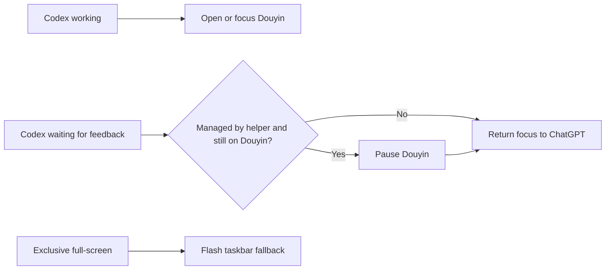

[中文](README.md)

# Codex Douyin Assistant for Windows

A Windows tray utility that watches local Codex/ChatGPT session files and switches focus between the Douyin web page and ChatGPT at the appropriate times. It changes focus only under the conditions below and has no server or account integration.

## Release and CI

Get `DouyinForCodex.exe` from the [latest Release](https://github.com/tobyberry666/codex-douyin-windows/releases/latest), then place it beside `run.bat`. Builds and self-tests are verified on Windows by [GitHub Actions CI](.github/workflows/ci.yml).

## 30-Second Setup

1. Download `DouyinForCodex.exe` from the latest Release.
2. Put it in the same folder as `run.bat`.
3. Double-click `run.bat`. The utility stays in the system tray.

## Behavior Flow



- When Codex is working and automatic browsing is enabled, the utility opens or focuses the Douyin web page.
- When Codex needs feedback, the automatic path pauses playback only when it previously managed the Douyin session and Douyin is still active, then returns focus to ChatGPT so it does not send keys to other windows.
- If exclusive full-screen mode prevents focus changes, the ChatGPT taskbar icon flashes as a fallback notification.

## Tray States and Commands

- `▶`: ChatGPT is working and Douyin is playing.
- `⏸`: Monitoring is active, or ChatGPT is waiting for feedback.
- Right-click menu: status, automatic browsing toggle, open Douyin, pause and return to ChatGPT, and exit.

## Build from Source

Windows with the built-in .NET Framework 4.x is required. From the repository root, run:

```powershell
powershell -ExecutionPolicy Bypass -File build.ps1
```

The script produces `DouyinForCodex.exe` from `helper.cs`; start it with `run.bat` afterward.

## Self-Test and CI

`build.ps1` enforces `--self-test` at runtime and exits with a nonzero status on failure. CI also verifies that the generated `DouyinForCodex.exe` exists and is nonempty.

## Privacy

The utility watches local Codex/ChatGPT session files only to determine state and changes focus under the documented conditions. It has no server, account, or network integration; this README does not expose session contents, paths, or logs.

## Known Limitations

- Only Douyin in a browser is supported; the Douyin desktop client is not detected.
- Automatic behavior can stop working if local session files move; manual tray commands remain available.
- Windows privilege isolation can prevent a background utility from focusing ChatGPT when ChatGPT runs with higher privileges.
- Exclusive full-screen apps cannot be displaced; the taskbar-flash notification is the fallback.

## License

Released under the [MIT License](LICENSE).
